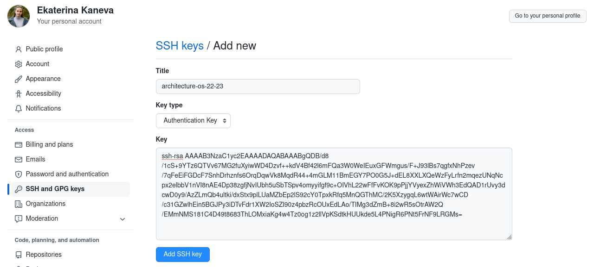
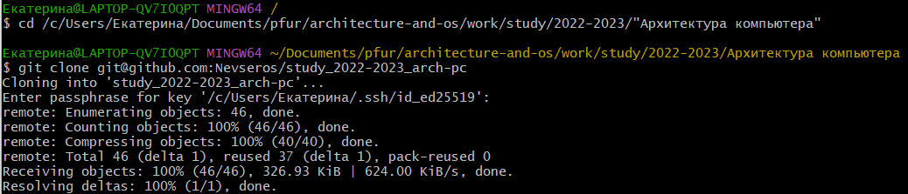

---
## Front matter
title: "Отчёт по лабораторной работе №3"
subtitle: "Дисциплина: Архитектура компьютера"
author: "Канева Екатерина Павловна"

## Generic otions
lang: ru-RU
toc-title: "Содержание"

## Bibliography
bibliography: bib/cite.bib
csl: pandoc/csl/gost-r-7-0-5-2008-numeric.csl

## Pdf output format
toc: true # Table of contents
toc-depth: 2
lof: true # List of figures
lot: true # List of tables
fontsize: 12pt
linestretch: 1.5
papersize: a4
documentclass: scrreprt
## I18n polyglossia
polyglossia-lang:
  name: russian
  options:
	- spelling=modern
	- babelshorthands=true
polyglossia-otherlangs:
  name: english
## I18n babel
babel-lang: russian
babel-otherlangs: english
## Fonts
mainfont: PT Serif
romanfont: PT Serif
sansfont: PT Sans
monofont: PT Mono
mainfontoptions: Ligatures=TeX
romanfontoptions: Ligatures=TeX
sansfontoptions: Ligatures=TeX,Scale=MatchLowercase
monofontoptions: Scale=MatchLowercase,Scale=0.9
## Biblatex
biblatex: true
biblio-style: "gost-numeric"
biblatexoptions:
  - parentracker=true
  - backend=biber
  - hyperref=auto
  - language=auto
  - autolang=other*
  - citestyle=gost-numeric
## Pandoc-crossref LaTeX customization
figureTitle: "Рис."
tableTitle: "Таблица"
listingTitle: "Листинг"
lofTitle: "Список иллюстраций"
lotTitle: "Список таблиц"
lolTitle: "Листинги"
## Misc options
indent: true
header-includes:
  - \usepackage{indentfirst}
  - \usepackage{float} # keep figures where there are in the text
  - \floatplacement{figure}{H} # keep figures where there are in the text
---

# Цель работы

Целью работы является изучение идеологии и применение средств контроля версий, приобретение практических навыков по работе с системой git.

# Выполнение лабораторной работы

### Настройка  GitHub

Предварительно мною уже был создан аккаунт на сайте https://github.com, а также была заполнена основная информация (рис. [-@fig:fig001]):

{#fig:001 width=70%}

### Базовая настройка git.

Сначала сделаем предварительную конфигурацию git. Откроем терминал и введём следующие команды, указав свои имя и email (рис. [-@fig:fig002]):

```
git config --global user.name "Ekaterina Kaneva" 
git config --global user.email "nkanevan@gmail.com"
```

{#fig:fig002 width=70%}

Настроим utf-8 в выводе сообщений git (рис. [-@fig:fig003]): 

```
git config --global core.quotepath false 
```

{#fig:fig003 width=70%}

Зададим имя начальной ветки – master (рис. [-@fig:fig004]): 

```
git config --global init.defaultBranch master
```

{#fig:fig004 width=70%}

Параметр autocrlf (рис. [-@fig:fig005]) и safecrlf (рис. [-@fig:fig006]):

```
git config --global core.autocrlf input
git config --global core.safecrlf warn
```

{#fig:fig005 width=70%}

{#fig:fig006 width=70%}

### Создание SSH ключа.

Для последующей идентификации на сервере репозиториев сгенерируем пару ключей – приватный и открытый (рис. [-@fig:fig007]):

```
ssh-keygen -C "Ekaterina Kaneva nkanevan@gmail.com"
```

{#fig:fig007 width=70%}

Далее, чтобы добавить новый сгенерированный ключ, авторизуемся на сайте github.org и введём новый ключ в настройках. Чтобы скопировать ключ, в консоль введём следующую команду, а затем скопируем ключ (рис. [-@fig:fig008]):

```
cat ~/.ssh/id_rsa.pub
```

{#fig:fig008 width=70%}

Теперь добавим ключ (рис. [-@fig:fig009]):

{#fig:fig009 width=70%}

### Создание рабочего пространства и репозитория курса на основе шаблона.

Откроем терминал и создадим каталог для предмета «Архитектура компьютера» (рис. [-@fig:fig010]): 

```
mkdir -p ~/work/study/2022-2023/«Архитектура компьютера»
```

{#fig:fig010 width=70%}

Используем указанный в тексте лабораторной работы шаблон для собственного репозитория (рис. [-@fig:fig011]):

{#fig:fig011 width=70%}

В открывшемся окне зададим имя репозитория study_2022-2023_arch-pc и создадим репозиторий (рис. [-@fig:fig012]):

{#fig:fig012 width=70%}

Откроем терминал и перейдём в каталог курса (рис. [-@fig:fig013]):
 
```
cd ~/work/study/2022-2023/"Архитектура компьютера"
```

{#fig:fig013 width=70%}

Клонируем созданный репозиторий (рис. [-@fig:fig014]):

```
git clone --recursive git@github.com:/study_2022–2023_arh-pc.git arch-pc
```

{#fig:fig014 width=70%}

### Настройка каталога курса

Перейдём в каталог курса, указав относительный путь (рис. [-@fig:fig015]):

{#fig:fig015 width=70%}

Удалим лишние файлы и создадим необходимые каталоги (рис. [-@fig:fig016]):

```
rm package.json
echo arch-pc > COURSE
make
```

{#fig:fig016 width=70%}

Отправим файлы на сервер (рис. [-@fig:fig017], [-@fig:fig018]): 

```
git add . 
git commit -am 'feat(main): make course structure' 
git push
```

{#fig:fig017 width=70%}

{#fig:fig018 width=70%}

Теперь проверим, что файлы действительно отправились на сервер (рис. [-@fig:fig019], [-@fig:fig020]):

{#fig:fig019 width=70%}

{#fig:fig020 width=70%}

Содержание каталога labs совпадает, остальные каталоги также проверены.

### Задания для самостоятельной работы

1. Создайте отчет по выполнению лабораторной работы в соответствующем каталоге рабочего пространства (`labs\lab03\report`). 
2. Скопируйте отчеты по выполнению предыдущих лабораторных работ в соответствующие каталоги созданного рабочего пространства. 
3. Загрузите файлы на github.

Поскольку предыдущие 2 отчёта и этот, третий (создавался в процессе выполнения работы, поэтому был почти готов, когда были прочитаны задания для самостоятельной работы), были составлены на хост-машине, а не на виртуальной, загружать их через виртуальную машину мне показалось достаточно долгим и чуть более сложным занятием, чем клонирование репозитория на хост-машину и работа с ним через заранее установленный на хост-машине git. 

Создадим нужные каталоги в хост машине. Для этого откроем командную строку (cmd), перейдём в каталог, в котором хранятся результаты моей работы по дисциплине «Архитектура компьютера», и создадим каталог подобно тому, что создавался ранее на виртуальной машине (рис. [-@fig:fig021]):

```
cd Documents\pfur\architecture-and-os
md work\study\2022-2023\”Архитектура компьютера”
```

{#fig:fig021 width=70%}

После этого откроем консоль git-bash, перейдём в каталог «Архитектура компьютера» и клонируем туда репозиторий (рис. [-@fig:fig022]):

```
cd /c/Users/Екатерина/Documents/pfur/architecture-and-os/work/study/2022-2023/”Архитектура компьютера”
git clone git@github.com:Nevseros/study_2022-2023_arch-pc
```

{#fig:fig022 width=70%}

Поскольку изначально отчёт создавался в `C:\Users\Екатерина\Documents\pfur\architecture-and-os`, его теперь надо скопировать в нужную директорию (правда, с первого раза получилось не туда, на каталог выше). Для этого введём команду уже в Windows PowerShell (рис. [-@fig:fig023]):

```
copy C:\Users\Екатерина\Documents\pfur\architecture-and-os\lab03-kaneva-report.docx  C:\Users\Екатерина\Documents\pfur\architecture-and-os\work\study\2022-2023 \"Архитектура компьютера"\study_2022-2023_arch-pc\labs\lab03
```

{#fig:fig023 width=70%}

Видим, что скопировали не туда и забыли переименовать, значит нужно ввести ещё пару команд – для перехода в каталог «Архитектура компьютера» (рис. [-@fig:fig024]) и для переноса и переименования файла (рис. [-@fig:fig025]):

```
cd C:\Users\Екатерина\Documents\pfur\architecture-and-os\work\study\2022-2023 \"Архитектура компьютера"\study_2022-2023_arch-pc\labs\lab03
move lab03-kaneva-report.docx report\lab03.docx
```

{#fig:fig024 width=70%}

{#fig:fig025 width=70%}

Теперь проверим, что файл отчёта к лабораторной действительно в нужном каталоге и под нужным названием (рис. [-@fig:fig026]):

```
cd report
dir
```

{#fig:fig026 width=70%}

Теперь, когда видим, что документ находится в нужном каталоге, можем далее вносить в него изменения. Чтобы открыть документ в редакторе Word, введём команду (ради команды `ii` и был выполнен переход из обычной Командной строки в Windows PowerShell) (рис. [-@fig:fig027]):

```
ii lab03.docx
```

{#fig:fig027 width=70%}

Через PowerShell также переместим, переименовывая, отчёты по работам 1 и 2 (рис. [-@fig:fig028]):

```
cd C:\Users\Екатерина\Documents\pfur\architecture-and-os
dir 
move lab01-kaneva-report.pdf work\study\2022-2023\"Архитектура компьютера"\study_2022-2023_arch-pc\labs\lab01\report\lab01.pdf
move lab01.docx work\study\2022-2023\"Архитектура компьютера"\study_2022-2023_arch-pc\labs\lab01\report\lab01.docx
move lab02-kaneva-report.pdf work\study\2022-2023\"Архитектура компьютера"\study_2022-2023_arch-pc\labs\lab02\report\lab02.pdf
move lab02-kaneva-report.docx work\study\2022-2023\"Архитектура компьютера"\study_2022-2023_arch-pc\labs\lab02\report\lab02.docx
```

{#fig:fig028 width=70%}

Загрузим файлы на github с помощью git-bash (рис. [-@fig:fig029] и [-@fig:fig030]):

```
cd /c/Users/Екатерина/Documents/pfur/architecture-and-os/work/study/2022-2023/"Архитектура компьютера"/study_2022-2023_arch-pc/labs
cd lab01/report
git add lab01.docx lab01.pdf
git commit -am "Add report for lab01"
git push origin master
cd ..
cd ..
cd lab02/report
git add lab02.pdf lab02.docx
git commit -am "Add report for lab02"
git push origin master
```

{#fig:fig029 width=70%}

{#fig:fig030 width=70%}

Теперь аналогично этим отчётам добавим отчёт 3, доделая его предварительно (сохраним в форматах .pdf и .docx). Для того, чтобы закоммитить его, введём в git-bash команды (снимка экрана не будет, иначе как я отчёт доделаю):

```
cd ..
cd ..
cd lab03/report
git add lab03.pdf lab03.docx
git commit -am "Add report for lab03"
git push origin master
```

# Выводы

Изучили идеологию и применение системы контроля версий. Приобрели практические навыки работы с системой git. 

