---
## Front matter
title: "Отчёт по лабораторной работе №5"
subtitle: "Дисциплина: Архитектура компьютера"
author: "Канева Екатерина Павловна"

## Generic otions
lang: ru-RU
toc-title: "Содержание"

## Bibliography
bibliography: bib/cite.bib
csl: pandoc/csl/gost-r-7-0-5-2008-numeric.csl

## Pdf output format
toc: true # Table of contents
toc-depth: 2
lof: true # List of figures
lot: true # List of tables
fontsize: 12pt
linestretch: 1.5
papersize: a4
documentclass: scrreprt
## I18n polyglossia
polyglossia-lang:
  name: russian
  options:
	- spelling=modern
	- babelshorthands=true
polyglossia-otherlangs:
  name: english
## I18n babel
babel-lang: russian
babel-otherlangs: english
## Fonts
mainfont: PT Serif
romanfont: PT Serif
sansfont: PT Sans
monofont: PT Mono
mainfontoptions: Ligatures=TeX
romanfontoptions: Ligatures=TeX
sansfontoptions: Ligatures=TeX,Scale=MatchLowercase
monofontoptions: Scale=MatchLowercase,Scale=0.9
## Biblatex
biblatex: true
biblio-style: "gost-numeric"
biblatexoptions:
  - parentracker=true
  - backend=biber
  - hyperref=auto
  - language=auto
  - autolang=other*
  - citestyle=gost-numeric
## Pandoc-crossref LaTeX customization
figureTitle: "Рис."
tableTitle: "Таблица"
listingTitle: "Листинг"
lofTitle: "Список иллюстраций"
lotTitle: "Список таблиц"
lolTitle: "Листинги"
## Misc options
indent: true
header-includes:
  - \usepackage{indentfirst}
  - \usepackage{float} # keep figures where there are in the text
  - \floatplacement{figure}{H} # keep figures where there are in the text
---

# Цель работы

Целью данной работы является освоение процедуры компиляции и сборки программ, написанных на ассемблере NASM.

# Задание

1. В каталоге `~/work/study/2022-2023/"Архитектура компьютера"/arch-pc/labs/lab05/programs` с помощью команды cp создайте копию файла `hello.asm` с именем `lab5.asm`.
2. С помощью любого текстового редактора внесите изменения в текст программы в файле lab5.asm так, чтобы вместо `Hello world!` на экран выводилась строка с вашими фамилией и именем.
3. Оттранслируйте полученный текст программы `lab5.asm` в объектный файл. Выполните компоновку объектного файла и запустите получившийся исполняемый файл.
4. Скопируйте файлы `hello.asm` и `lab5.asm` в Ваш локальный репозиторий в каталог `~/work/study/2022-2023/"Архитектура компьютера"/arch-pc/labs/lab05/`. Загрузите файлы на GitHub.

# Теоретическое введение
## Основные принципы работы компьютера

Основными функциональными элементами любой электронно-вычислительной машины (ЭВМ) являются центральный процессор, память и периферийные устройства.

Взаимодействие этих устройств осуществляется через общую шину, к которой они подключены. Физически шина представляет собой большое количество проводников, соединяющих устройства друг с другом. В современных компьютерах проводники выполнены в виде электропроводящих дорожек на материнской (системной) плате.

Основной задачей процессора является обработка информации, а также организация координации всех узлов компьютера. В состав центрального процессора (ЦП) входят следующие устройства:

• **арифметико-логическое устройство (АЛУ)** — выполняет логические и арифметические действия, необходимые для обработки информации, хранящейся в памяти;

• **устройство управления (УУ)** — обеспечивает управление и контроль всех устройств компьютера;

• **регистры** — сверхбыстрая оперативная память небольшого объёма, входящая в состав процессора, для временного хранения промежуточных результатов выполнения инструкций; регистры процессора делятся на два типа: *регистры общего назначения* и *специальные регистры*.

Другим важным узлом ЭВМ является **оперативное запоминающее устройство (ОЗУ)**. ОЗУ — это быстродействующее энергозависимое запоминающее устройство, которое напрямую взаимодействует с узлами процессора, предназначенное для хранения программ и данных, с которыми процессор непосредственно работает в текущий момент. ОЗУ состоит из одинаковых пронумерованных ячеек памяти. Номер ячейки памяти — это адрес хранящихся в ней данных.

В состав ЭВМ также входят периферийные устройства, которые можно разделить на:

• **устройства внешней памяти**, которые предназначены для долговременного хранения больших объёмов данных (жёсткие диски, твердотельные накопители, магнитные ленты);

• **устройства ввода-вывода**, которые обеспечивают взаимодействие ЦП с внешней средой.

При выполнении каждой команды процессор выполняет определённую последовательность стандартных действий, которая называется командным циклом процессора. В самом общем виде он заключается в следующем:

1. Формирование адреса в памяти очередной команды;

2. Считывание кода команды из памяти и её дешифрация;

3. Выполнение команды;

4. Переход к следующей команде.

Данный алгоритм позволяет выполнить хранящуюся в ОЗУ программу. Кроме того, в зависимости от команды при её выполнении могут проходить не все этапы.

## Ассемблер и язык ассемблера

**Язык ассемблера (assembly language, сокращённо asm)** — машинно-ориентированный язык низкого уровня. Можно считать, что он больше любых других языков приближен к архитектуре ЭВМ и её аппаратным возможностям, что позволяет получить к ним более полный доступ, нежели в языках высокого уровня, таких как C/C++, Perl, Python и пр. Заметим, что получить полный доступ к ресурсам компьютера в современных архитектурах нельзя, самым низким уровнем работы прикладной программы является обращение напрямую к ядру операционной системы. Именно на этом уровне и работают программы, написанные на ассемблере. Но в отличие от языков высокого уровня ассемблерная программа содержит только тот код, который ввёл программист. Таким образом язык ассемблера — это язык, с помощью которого понятным для человека образом пишутся команды для процессора.

Следует отметить, что процессор понимает не команды ассемблера, а последовательности из нулей и единиц — **машинные коды**. До появления языков ассемблера программистам приходилось писать программы, используя только лишь машинные коды, которые были крайне сложны для запоминания, так как представляли собой числа, записанные в двоичной или шестнадцатеричной системе счисления. Преобразование или трансляция команд с языка ассемблера в исполняемый машинный код осуществляется специальной программой транслятором — **ассемблером**.

## Процесс создания и обработки программы на языке ассемблера

В процессе создания ассемблерной программы можно выделить четыре шага:

• **Набор текста** программы в текстовом редакторе и сохранение её в отдельном файле. Каждый файл имеет свой тип (или расширение), который определяет назначение файла. Файлы с исходным текстом программ на языке ассемблера имеют тип asm.

• **Трансляция** — преобразование с помощью транслятора, например nasm, текста программы в машинный код, называемый объектным. На данном этапе также может быть получен листинг программы, содержащий кроме текста программы различную дополнительную информацию, созданную транслятором. Тип объектного файла — o, файла листинга — lst.

• **Компоновка или линковка** — этап обработки объектного кода компоновщиком (ld), который принимает на вход объектные файлы и собирает по ним исполняемый файл. Исполняемый файл обычно не имеет расширения. Кроме того, можно получить файл карты загрузки программы в ОЗУ, имеющий расширение map.

• **Запуск программы.** Конечной целью является работоспособный исполняемый файл. Ошибки на предыдущих этапах могут привести к некорректной работе программы, поэтому может присутствовать этап отладки программы при помощи специальной программы — отладчика. При нахождении ошибки необходимо провести коррекцию программы, начиная с первого шага.


# Выполнение лабораторной работы
## Лабораторная работа

Сначала создадим папку, в которой будут созданы программы на языке ассемблера NASM. Для этого введём следующие команды (рис. [-@fig:fig001]):

```
cd work/study/2022-2023/"Архитектура компьютера"/arch-pc/labs/lab05
mkdir programs
ls
```

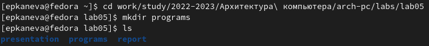{#fig:fig001 width=70%}

Затем перейдём в созданный каталог, создадим файл `hello.asm` и откроем его в gedit (рис. [-@fig:fig002]):

```
cd programs
touch hello.asm
gedit hello.asm
```

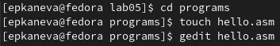{#fig:fig002 width=70%}

В созданном файле введём нужный текст (рис. [-@fig:fig003]):

```
; hello.asm

SECTION .data				; Начало секции данных
    hello:      DB 'Hello, world!',10   ; 'Hello world!' плюс
    					; символ перевода строки
    helloLen:   EQU $-hello             ; Длина строки hello
    
SECTION .text		; Начало секции кода
    GLOBAL_start           

_start:   		; Точка входа в программу              
    mov eax,4		; Системный вызов для записи (sys_write)
    mov ebx,1		; Описатель файла '1' - стандартный вывод
    mov ecx,hello	; Адрес строки hello в ecx
    mov edx,helloLen	; Размер строки hello
    int 0x80		; Вызов ядра
  
    mov eax,1		; Системный вызов для выхода (sys_exit)
    mov ebx,0		; Выход с кодом возврата '0' (без ошибок)
    int 0x80		; Вызов ядра
```

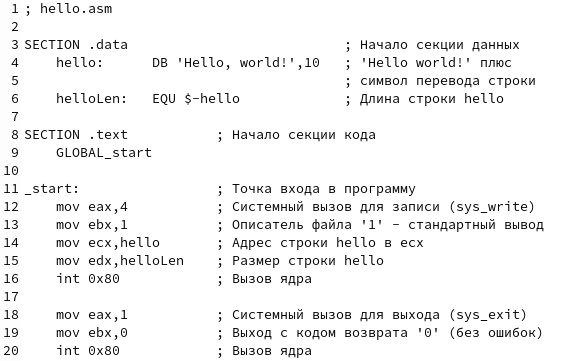{#fig:fig003 width=70%}

Для компиляции текста программы введём следующую команду (рис. [-@fig:fig004]):

```
nasm -f elf hello.asm
ls
```

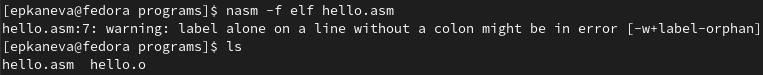{#fig:fig004 width=70%}

Видим, что объектный файл имеет имя `hello.o.`

Теперь скомпилируем файл с присвоением другого имени, а также создадим файл листинга; проверим создание файлов (рис. [-@fig:fig005]):

```
nasm -o obj.o -f elf -g -l list.lst hello.asm
ls
```

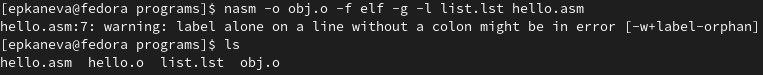{#fig:fig005 width=70%}

Далее передадим объектный файл `hello.o` на обработку компоновщику и проверим создание исполняемого файла (рис. [-@fig:fig006]):

```
ld -m elf_i386 hello.o -o hello
ls
```

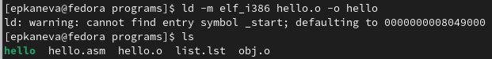{#fig:fig006 width=70%}

Теперь передадим компоновщику на обработку объектный файл `obj.o` и проверим создание исполняемого файла (рис. [-@fig:fig007]):

```
ld -m elf_i386 obj.o -o main
ls
```

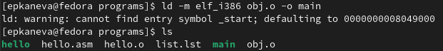{#fig:fig007 width=70%}

Исполняемый файл имеет имя `main`, объектный файл `obj.o`.

Теперь запустим на выполнение исполняемый файл `hello` (рис. [-@fig:fig008]):

```
./hello
```

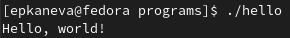{#fig:fig008 width=70%}

## Самостоятельная работа

Теперь всё то же самое проделаем для того, чтобы на экран были выведены фамилия и имя. Скопируем файл `hello.asm` под именем `lab5.asm`, проверим выполнение действия (рис. [-@fig:fig009]):

```
cp hello.asm lab5.asm
ls
```

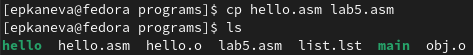{#fig:fig009 width=70%}

Откроем файл `lab5.asm` в gedit (рис. [-@fig:fig010]) и изменим текст программы так, чтобы при исполнении файла на экран выводились фамилия и имя (рис. [-@fig:fig011]):

```
gedit lab5.asm
```

{#fig:fig010 width=70%}

```
; lab5.asm

SECTION .data				   ; Начало секции данных
    lab5:      DB 'Ekaterina Kaneva',10    ; 'Ekaterina Kaneva' плюс
    					   ; символ перевода строки
    lab5Len:   EQU $-lab5                  ; Длина строки lab5
    
SECTION .text		; Начало секции кода
    GLOBAL_start           

_start:   		; Точка входа в программу              
    mov eax,4		; Системный вызов для записи (sys_write)
    mov ebx,1		; Описатель файла '1' - стандартный вывод
    mov ecx,lab5	; Адрес строки lab5 в ecx
    mov edx,lab5Len	; Размер строки lab5
    int 0x80		; Вызов ядра
  
    mov eax,1		; Системный вызов для выхода (sys_exit)
    mov ebx,0		; Выход с кодом возврата '0' (без ошибок)
    int 0x80		; Вызов ядра
```

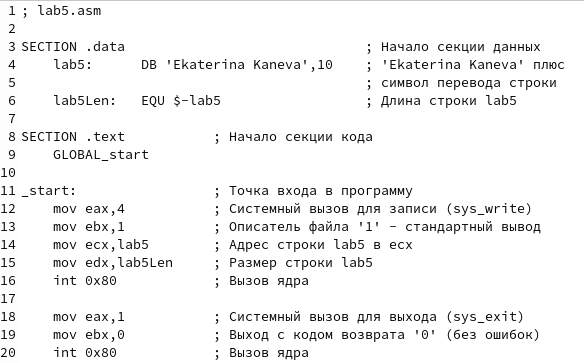{#fig:fig011 width=70%}

Используя те же команды, что и ранее, создадим объектный файл, исполняемый файл и запустим программу в терминале (рис. [-@fig:fig012]):

```
nasm -f elf lab5.asm
ld -m elf_i386 lab5.o -o lab5
./lab5
```

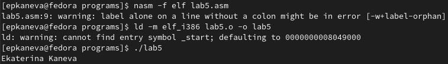{#fig:fig012 width=70%}

Файлы `lab5.asm` и `hello.asm` перенесём в каталог `~/work/study/2022-2023/"Архитектура компьютера"/arch-pc/labs/lab05/`, ненужные файлы и каталог удалим, проверим корректность выполнения команд (рис. [-@fig:fig013]), загрузим всё на GitHub.

```
cd ..
cp programs/hello.asm hello.asm
cp programs/lab5.asm lab5.asm
ls
rm -r programs
ls
```

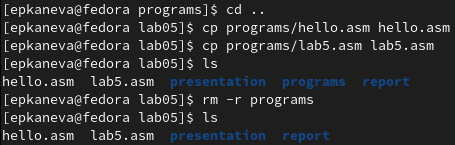{#fig:fig013 width=70%}

# Выводы

Освоили процедуру компиляции и сборки программ, написанных на ассемблере NASM.
