---
## Front matter
title: "Отчёт по лабораторной работе №6"
subtitle: "Дисциплина: Архитектура компьютера"
author: "Канева Екатерина Павловна"

## Generic otions
lang: ru-RU
toc-title: "Содержание"

## Bibliography
bibliography: bib/cite.bib
csl: pandoc/csl/gost-r-7-0-5-2008-numeric.csl

## Pdf output format
toc: true # Table of contents
toc-depth: 2
lof: true # List of figures
lot: true # List of tables
fontsize: 12pt
linestretch: 1.5
papersize: a4
documentclass: scrreprt
## I18n polyglossia
polyglossia-lang:
  name: russian
  options:
	- spelling=modern
	- babelshorthands=true
polyglossia-otherlangs:
  name: english
## I18n babel
babel-lang: russian
babel-otherlangs: english
## Fonts
mainfont: PT Serif
romanfont: PT Serif
sansfont: PT Sans
monofont: PT Mono
mainfontoptions: Ligatures=TeX
romanfontoptions: Ligatures=TeX
sansfontoptions: Ligatures=TeX,Scale=MatchLowercase
monofontoptions: Scale=MatchLowercase,Scale=0.9
## Biblatex
biblatex: true
biblio-style: "gost-numeric"
biblatexoptions:
  - parentracker=true
  - backend=biber
  - hyperref=auto
  - language=auto
  - autolang=other*
  - citestyle=gost-numeric
## Pandoc-crossref LaTeX customization
figureTitle: "Рис."
tableTitle: "Таблица"
listingTitle: "Листинг"
lofTitle: "Список иллюстраций"
lotTitle: "Список таблиц"
lolTitle: "Листинги"
## Misc options
indent: true
header-includes:
  - \usepackage{indentfirst}
  - \usepackage{float} # keep figures where there are in the text
  - \floatplacement{figure}{H} # keep figures where there are in the text
---

# Цель работы

Целью работы является приобретение практических навыков работы в Midnight Commander. Освоение инструкций языка ассемблера mov и int.

# Задание

Создать файлы, выводящие строку "Введите строку:" и выводящие введённую строку на экран, с использованием файла `in_out.asm` и без него.

# Теоретическое введение

Midnight Commander (или просто mc) — это программа, которая позволяет
просматривать структуру каталогов и выполнять основные операции по управ-
лению файловой системой, т.е. mc является файловым менеджером. Midnight
Commander позволяет сделать работу с файлами более удобной и наглядной.

Для активации оболочки Midnight Commander достаточно ввести в командной строке mc и нажать клавишу `Enter`.

: Функциональные клавиши Midnight Commander {#tbl:functional}

| Функциональные клавиши | Выполняемое действие                                                                                                                                        |
|------------------------|-------------------------------------------------------------------------------------------------------------------------------------------------------------|
| `F1`                   | вызов контекстно-зависимой подсказки                                                                                                                        |
| `F2`                   | вызов меню, созданного пользователем                                                                                                                        |
| `F3`                   | просмотр файла, на который указывает подсветка в активной панели                                                                                            |
| `F4`                   | вызов встроенного редактора для файла, на который указывает подсветка в активной панели                                                                     |
| `F5`                   | копирование файла или группы отмеченных файлов из каталога, отображаемого в активной панели, в каталог, отображаемый на второй панели                       |
| `F6`                   | перенос файла или группы отмеченных файлов из каталога, отображаемого в активной панели, в каталог, отображаемый на второй панели                           |
| `F7`                   | создание подкаталога в каталоге, отображаемом в активной панели                                                                                             |
| `F8`                   | удаление файла (подкаталога) или группы отмеченных файлов                                                                                                   |
| `F9`                   | вызов основного меню программы                                                                                                                              |
| `F10`                  | выход из программы                                                                                                                                          |

Следующие комбинации клавиш облегчают работу с Midnight Commander:

* `Tab` используется для переключениями между панелями;
* $\uparrow$ и $\downarrow$ используется для навигации, `Enter` для входа в каталог или открытия файла (если в файле расширений `mc.ext` заданы правила связи определённых расширений файлов с инструментами их запуска или обработки);
* `Ctrl + u` (или через меню `Команда` $\rightarrow$ `Переставить панели`) меняет местами содержимое правой и левой панелей;
* `Ctrl + o` (или через меню `Команда` $\rightarrow$ `Отключить панели`) скрывает или возвращает панели `Midnight Commander`, за которыми доступен для работы командный интерпретатор оболочки и выводимая туда информация.
* `Ctrl + x + d` (или через меню `Команда` $\rightarrow$ `Сравнить каталоги`) позволяет сравнить содержимое каталогов, отображаемых на левой и правой панелях.

Программа на языке ассемблера NASM, как правило, состоит из трёх секций: секция кода программы (`SECTION .text`), секция инициированных (известных во время компиляции) данных (`SECTION .data`) и секция неинициализированных данных (тех, под которые во время компиляции только отводится память, а значение присваивается в ходе выполнения программы) (`SECTION .bss`).

Для объявления инициированных данных в секции .data используются директивы DB, DW, DD, DQ и DT, которые резервируют память и указывают, какие значения должны храниться в этой памяти:

* `DB` (define byte) — определяет переменную размером в 1 байт;
* `DW` (define word) — определяет переменную размеров в 2 байта (слово);
* `DD` (define double word) — определяет переменную размером в 4 байта (двойное слово);
* `DQ` (define quad word) — определяет переменную размером в 8 байт (учетверённое слово);
* `DT` (define ten bytes) — определяет переменную размером в 10 байт.

Директивы используются для объявления простых переменных и для объявления массивов. Для определения строк принято использовать директиву `DB` в связи с особенностями хранения данных в оперативной памяти.

Синтаксис директив определения данных следующий:

```
<имя> DB <операнд> [, <операнд>] [, <операнд>]
```

# Выполнение лабораторной работы

## Лабораторная работа

Откроем Midnight Commander (рис. [-@fig:001]):

```
mc
```

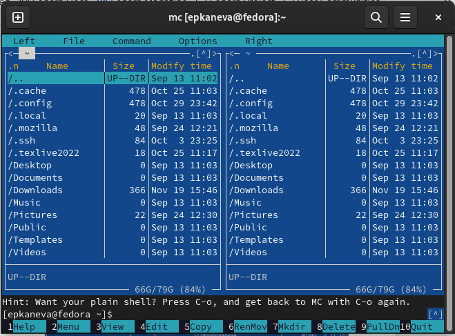{#fig:001 width=70%}

Пользуясь клавишами $\uparrow$, $\downarrow$ и `Enter`, перейдём в каталог `~/work/study/2022-2023/"Архитектура компьютера"/arh-pc`, созданный при выполнении предыдущей лабораторной работы (рис. [-@fig:002]):

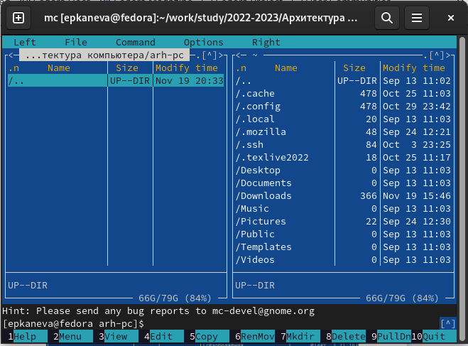{#fig:002 width=70%}

С помощью клавиши `F7` создадим каталог `lab06` и перейдём в него (рис. [-@fig:003]):

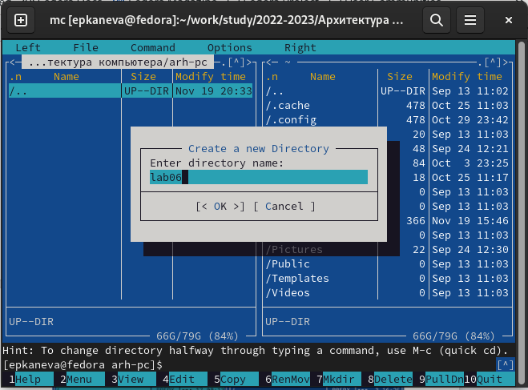{#fig:003 width=70%}

Создадим файл `lab6-1.asm` (рис. [-@fig:004]):

```
touch lab6-1.asm
```

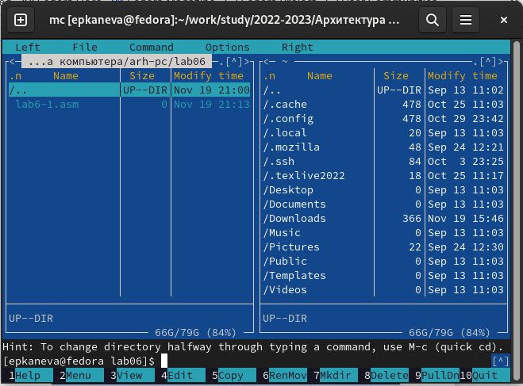{#fig:004 width=70%}

Откроем файл для редактирования с помощью функциональной клавиши `F4` и введём в него текст программы, данный в тексте лабораторной работы (рис. [-@fig:005]):

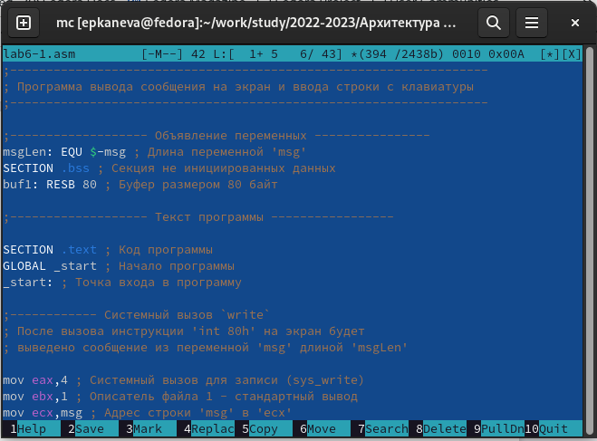{#fig:005 width=70%}

Сохраним и закроем файл. Откроем его снова уже с помощью клавиши `F3`, чтобы проверить, что программа введена - всё действительно корректно.

Теперь оттранслируем текст программы `lab6-1.asm` в объектный файл, выполним компоновку объектного файла и запустим исполняемый файл (рис. [-@fig:006]):

```
nasm -f elf lab6-1.asm
ld -m elf_i386 -o lab6-1 lab6-1.o
./lab6-1

```

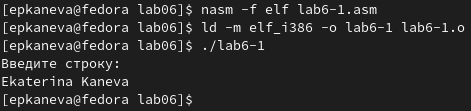{#fig:006 width=70%}

Скачаем файл `in_out.asm` из ТУИС, поместим его в один каталог с программами (рис. [-@fig:007]):

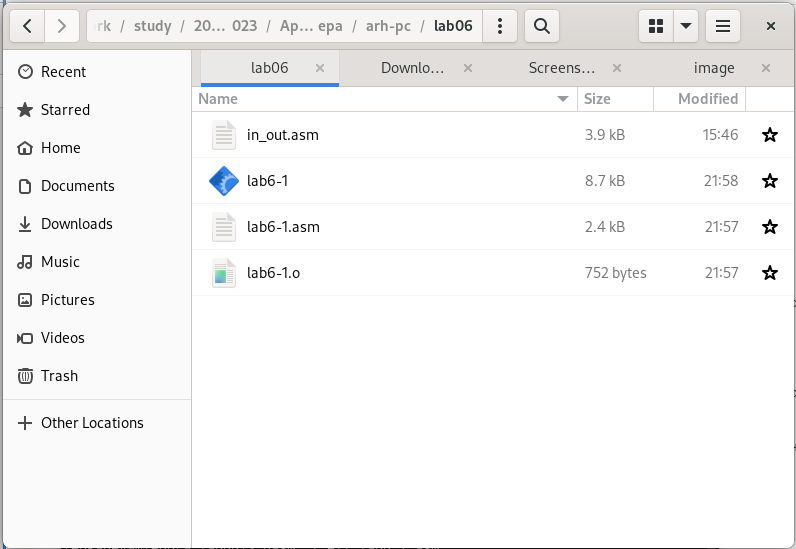{#fig:007 width=70%}

С помощью функциональной клавиши `F6` скопируем файл `lab6-1.asm` как файл `lab6-2.asm` (рис. [-@fig:008]):

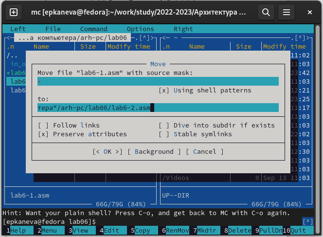{#fig:008 width=70%}

Исправим текст программы в файле `lab6-2.asm` в соответствии с заданием (рис. [-@fig:009]):

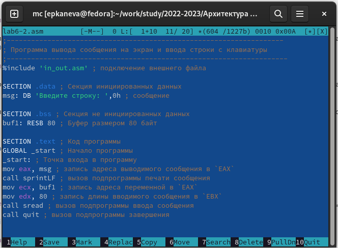{#fig:009 width=70%}

Создадим объектный файл, исполняемый файл, запустим программу (рис. [-@fig:010]):

```
nasm -f elf lab6-2.asm
ld -m elf_i386 -o lab6-2 lab6-2.o
./lab6-2
```

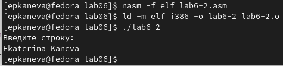{#fig:010 width=70%}

Заменим `sprintLF` на `sprint`, создадим объектный и исполняемый файлы, запустим программу (рис. [-@fig:011]):

```
nasm -f elf lab6-2.asm
ld -m elf_i386 -o lab6-2 lab6-2.o
./lab6-2
```

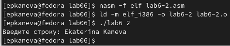{#fig:011 width=70%}

Видим, что теперь не происходит переход на новую строку для ввода текста.

## Самостоятельная работа

Создадим копию файла `lab6-1.asm` с именем `lab6-11.asm` (рис. [-@fig:012]):

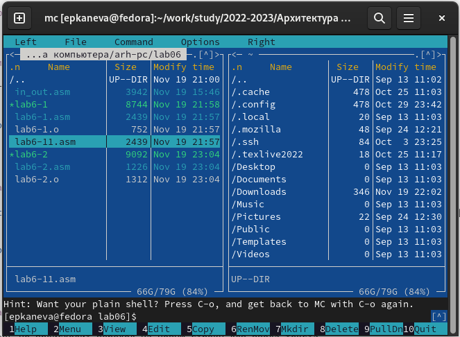{#fig:012 width=70%}

Внесём изменения в программу в соответствии с поставленным заданием (рис. [-@fig:013]):

```
SECTION .data
msg: DB 'Введите строку:',10

msgLen: EQU $-msg

SECTION .bss
buf1     RESB 80

SECTION .txt
GLOBAL _start
_start:

mov eax,4
mov ebx,1
mov ecx,msg
mov edx,msgLen
int 80h

mov eax,3
mov ebx,0
mov ecx,buf1
mov edx,80
int 80h

mov eax,4
mov ebx,1
mov ecx,buf1
mov edx,msgLen
int 80h

mov eax,1
mov ebx,0
int 80h
```

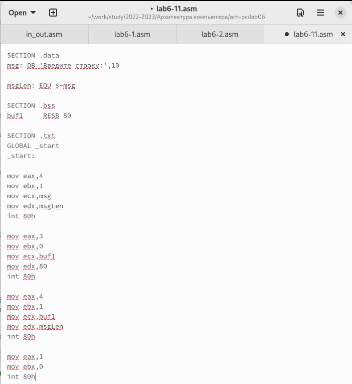{#fig:013 width=70%}

Создадим объектный файл, исполняемый файл, запустим программу (рис. [-@fig:014]):

```
nasm -f elf lab6-11.asm
ld -m elf_i386 -o lab6-11 lab6-11.o
./lab6-11
```

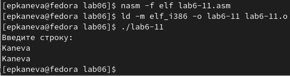{#fig:014 width=70%}

Создадим копию файла `lab6-2.asm` с именем `lab6-21.asm` (рис. [-@fig:015]):

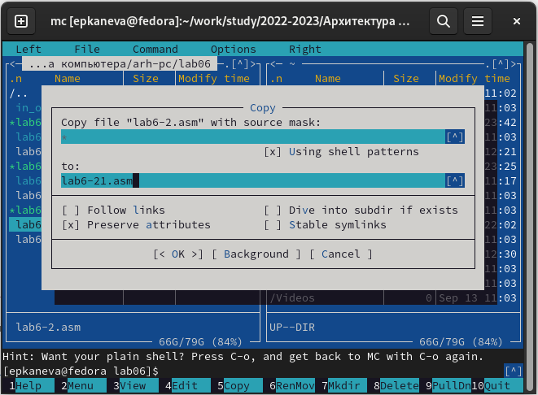{#fig:015 width=70%}

Изменим код программы, чтобы он работал в соответствии с заданием (рис. [-@fig:016]):

```
%include 'in_out.asm'

SECTION .data
msg:  DB 'Введите строку:',0h

SECTION  .bss
buf1:     RESB 80

SECTION .text
GLOBAL _start
_start:

mov eax, msg
call sprintLF

mov ecx, buf1
mov edx, 80
call sread

mov eax, buf1
call sprint

call quit
```

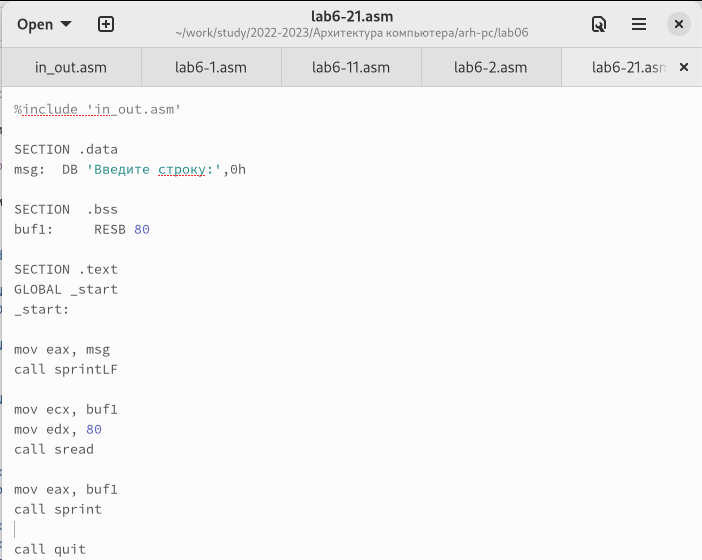{#fig:016 width=70%}

Создадим объектный файл, исполняемый файл, запустим программу (рис. [-@fig:017]):

```
nasm -f elf lab6-21.asm
ld -m elf_i386 -o lab6-21 lab6-21.o
./lab6-21
```

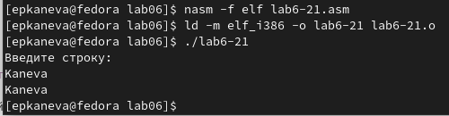{#fig:017 width=70%}

Как видим, программа работает корректно. 

Созданные файлы `*.asm` перенесём в каталог с отчётом, файлы загрузим на GitHub.

# Выводы

Приобретели практические навыки работы в Midnight Commander. Освоили инструкции языка ассемблера mov и int.

# Список литературы{.unnumbered}

::: {#refs}
:::
