---
## Front matter
title: "Отчёт по лабораторной работе №7"
subtitle: "Дисциплина: Архитектура компьютера"
author: "Канева Екатерина Павловна"

## Generic otions
lang: ru-RU
toc-title: "Содержание"

## Bibliography
bibliography: bib/cite.bib
csl: pandoc/csl/gost-r-7-0-5-2008-numeric.csl

## Pdf output format
toc: true # Table of contents
toc-depth: 2
lof: true # List of figures
lot: true # List of tables
fontsize: 12pt
linestretch: 1.5
papersize: a4
documentclass: scrreprt
## I18n polyglossia
polyglossia-lang:
  name: russian
  options:
	- spelling=modern
	- babelshorthands=true
polyglossia-otherlangs:
  name: english
## I18n babel
babel-lang: russian
babel-otherlangs: english
## Fonts
mainfont: PT Serif
romanfont: PT Serif
sansfont: PT Sans
monofont: PT Mono
mainfontoptions: Ligatures=TeX
romanfontoptions: Ligatures=TeX
sansfontoptions: Ligatures=TeX,Scale=MatchLowercase
monofontoptions: Scale=MatchLowercase,Scale=0.9
## Biblatex
biblatex: true
biblio-style: "gost-numeric"
biblatexoptions:
  - parentracker=true
  - backend=biber
  - hyperref=auto
  - language=auto
  - autolang=other*
  - citestyle=gost-numeric
## Pandoc-crossref LaTeX customization
figureTitle: "Рис."
tableTitle: "Таблица"
listingTitle: "Листинг"
lofTitle: "Список иллюстраций"
lotTitle: "Список таблиц"
lolTitle: "Листинги"
## Misc options
indent: true
header-includes:
  - \usepackage{indentfirst}
  - \usepackage{float} # keep figures where there are in the text
  - \floatplacement{figure}{H} # keep figures where there are in the text
---

# Цель работы

Целью лабораторной работы является освоение арифметических инструкций языка ассемблера NASM.

# Задание

1. Написать программу вычисления выражения y = f(x). Программа должна выводить выражение для вычисления, выводить запрос на ввод значения x, вычислять заданное выражение в зависимости от введенного x, выводить результат вычислений. Вид функции f(x) выбрать из таблицы вариантов заданий в соответствии с номером полученным при выполнении лабораторной работы. 
2. Создать исполняемый файл и проверить его работу для значений $x_1$ и $x_2$ .

# Теоретическое введение

Большинство инструкций на языке ассемблера требуют обработки операндов. Адрес операнда предоставляет место, где хранятся данные, подлежащие обработке. Это могут быть данные хранящиеся в регистре или в ячейке памяти. Далее рассмотрены все существующие способы задания адреса хранения операндов – способы адресации.

Существует три основных способа адресации:

* Регистровая адресация – операнды хранятся в регистрах и в команде используются имена этих регистров, например: `mov ax,bx`.
* Непосредственная адресация – значение операнда задается непосредственно в команде, Например: `mov ax,2`.
* Адресация памяти – операнд задает адрес в памяти. В команде указывается символическое обозначение ячейки памяти, над содержимым которой требуется выполнить операцию.

Схема команды целочисленного сложения `add` (от англ. addition - добавление) выполняет сложение двух операндов и записывает результат по адресу первого операнда. Команда `add` работает как с числами со знаком, так и без знака и выглядит следующим образом:

```
add <операнд_1>, <операнд_2>
```

Команда целочисленного вычитания `sub` (от англ. subtraction – вычитание) работает аналогично команде `add` и выглядит следующим образом:

```
sub <операнд_1>, <операнд_2>
```

Довольно часто при написании программ встречается операция прибавления или вычитания единицы. Прибавление единицы называется инкрементом, а вычитание — декрементом. Для этих операций существуют специальные команды: `inc` (от англ. increment) и `dec` (от англ. decrement), которые увеличивают и уменьшают на 1 свой операнд.

Эти команды содержат один операнд и имеет следующий вид:

```
inc <операнд>
dec <операнд>
```

Еще одна команда, которую можно отнести к арифметическим командам, это команда изменения знака `neg`:

```
neg <операнд>
```

Умножение и деление, в отличии от сложения и вычитания, для знаковых и беззнаковых чисел производиться по-разному, поэтому существуют различные команды.

Для беззнакового умножения используется команда `mul` (от англ. multiply – умножение):

```
mul <операнд>
```

Для знакового умножения используется команда `imul`:

```
imul <операнд>
```

Для деления, как и для умножения, существует 2 команды -- `div` (от англ. divide -- деление) и `idiv`:

```
div <делитель>  ; Беззнаковое деление
idiv <делитель> ; Знаковое деление
```

Для выполнения лабораторных работ в файле `in_out.asm` реализованы подпрограммы для преобразования ASCII символов в числа и обратно. Это:

* `iprint` – вывод на экран чисел в формате ASCII, перед вызовом `iprint` в регистр `eax` необходимо записать выводимое число (`mov eax,<int>`).
* `iprintLF` – работает аналогично `iprint`, но при выводе на экран после числа добавляет к символ перевода строки.
* `atoi` – функция преобразует ASCII-код символа в целое число и записывает результат в регистр `eax`, перед вызовом `atoi` в регистр `eax` необходимо записать число (`mov eax,<int>`).

# Выполнение лабораторной работы

## Лабораторная работа

Создадим каталог для программам лабораторной работы №7, перейдём в него и создадим файл `lab7-1.asm` (рис. [-@fig:001]):

```
mkdir work/study/2022-2023/"Архитектура компьютера"/arh-pc/lab07
cd work/study/2022-2023/"Архитектура компьютера"/arh-pc/lab07
touch lab7-1.asm
```

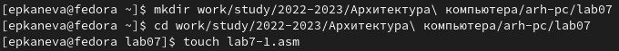{#fig:001 width=70%}

В файл `lab7-1.asm` введём текст программы, указанный в лабораторной работе (рис. [-@fig:002]):

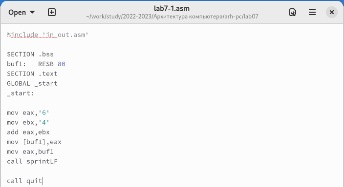{#fig:002 width=70%}

Создадим исполняемый файл и запустим его (рис. [-@fig:003]):

```
nasm -f elf lab7-1.asm
ld -m elf_i386 -o lab7-1 lab7-1.o
./lab7-1
```

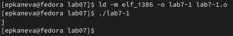{#fig:003 width=70%}

Видим, что программа вывела символ `j`.

Далее изменим текст программы и вместо символов запишем в регистры числа. Исправим текст программы (рис. [-@fig:004]):

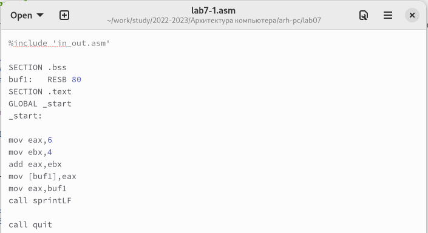{#fig:004 width=70%}

Создадим исполняемый файл и запустим его (рис. [-@fig:005]):

```
nasm -f elf lab7-1.asm
ld -m elf_i386 -o lab7-1 lab7-1.o
./lab7-1
```

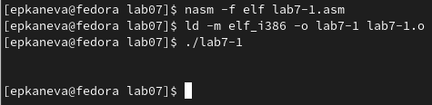{#fig:005 width=70%}

Программа выводит пустой символ. Это соответствует десятому символу в таблице ASCII. 

Создадим файл `lab7-2.asm` (рис. [-@fig:006]) и введём текст программы (рис. [-@fig:007]):

```
touch lab7-2.asm
```

{#fig:006 width=70%}

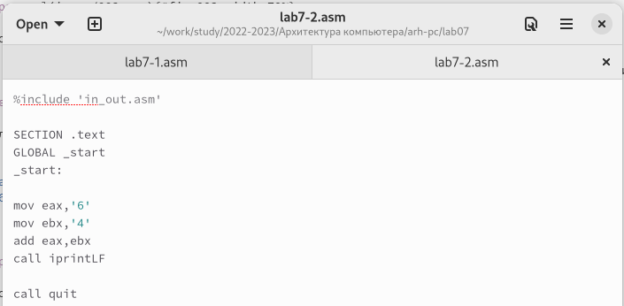{#fig:007 width=70%}

Создадим исполняемый файл и запустим его (рис. [-@fig:008]):

```
nasm -f elf lab7-2.asm
ld -m elf_i386 -o lab7-2 lab7-2.o
./lab7-2
```

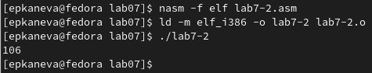{#fig:008 width=70%}

На экран вывелось число 106.

Теперь изменим символы на числа, как ранее (рис. [-@fig:009]) и запустим программу (рис. [-@fig:010]):

```
nasm -f elf lab7-2.asm
ld -m elf_i386 -o lab7-2 lab7-2.o
./lab7-2
```

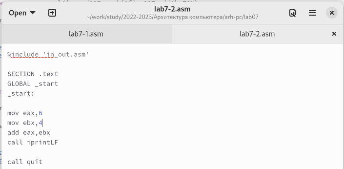{#fig:009 width=70%}

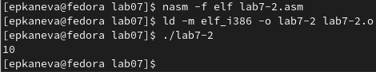{#fig:010 width=70%}

Заменим функцию `iprintLF` на `iprint` (рис. [-@fig:011]) и запустим программу (рис. [-@fig:012]):

```
nasm -f elf lab7-2.asm
ld -m elf_i386 -o lab7-2 lab7-2.o
./lab7-2
```

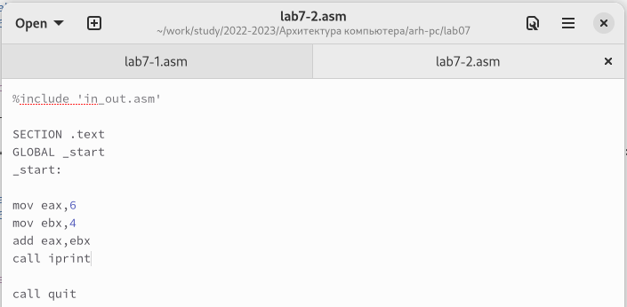{#fig:011 width=70%}

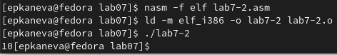{#fig:012 width=70%}

Программа вывела число 10 и в той же строке приглашение для следующей команды. Вывод функций отличается тем, что функция `iprintLF` выполняет переход на новую строку после вывода, а `iprint` нет.

Создадим файл `lab7-3.asm` (рис. [-@fig:013]), в него введём текст программы из лабораторной работы (рис. [-@fig:014]):

```
touch lab7-3.asm
```

{#fig:013 width=70%}

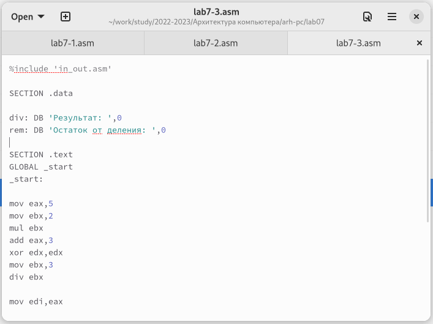{#fig:014 width=70%}

Создадим исполняемый файл и запустим его (рис. [-@fig:015]):

```
nasm -f elf lab7-3.asm
ld -m elf_i386 -o lab7-3 lab7-3.o
./lab7-3
```

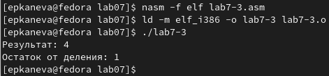{#fig:015 width=70%}

Программа работает корректно.

Далее создадим файл `variant.asm` (рис. [-@fig:016]):

```
touch variant.asm
```

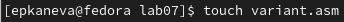{#fig:016 width=70%}

Введём текст программы вычисления номера варианта по номеру студенческого билета (рис. [-@fig:017]):

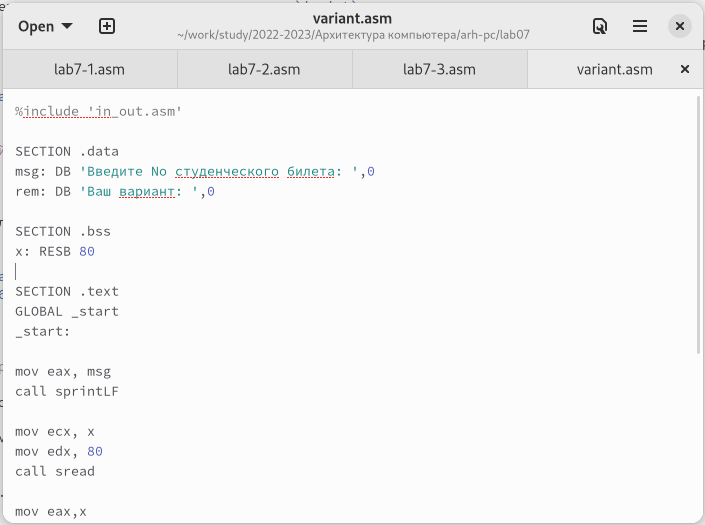{#fig:017 width=70%}

Создадим исполняемый файл и запустим его (рис. [-@fig:018]):

```
nasm -f elf variant.asm
ld -m elf_i386 -o variant variant.o
./variant
```

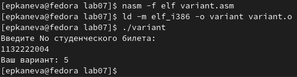{#fig:018 width=70%}

Программа вывела номер 5. Программа вычисляет вариант, прибавляя к остатку от деления номера варианта на 20 1 -- результат действительно должен получиться таким.

> 1. Какие строки отвечают за вывод на экран сообщения ‘Ваш вариант:’?

Строки, отвечающите за вывод этого сообщения на экран:

```
mov eax,rem
call sprint
```

> 2. Для чего используется следующие инструкции? 

```
mov ecx, x
mov edx, 80 
call sread
```

Эти строки отвечают за чтение вводимого номера студенческого билета.

> 3. Для чего используется инструкция “call atoi”?

Инструкция `call atoi` вызывает функцию `atoi`, которая преобразует ASCII-код символа в целое число и записывает результат в регистр `eax`.

> 4. Какие строки отвечают за вычисление варианта?

Строки, отвечающие за вычисление варианта:

```
xor edx,edx
mov ebx,20
div ebx
inc edx
```

> 5. В какой регистр записывается остаток от деления при выполнении инструкции “div ebx”?

В регистр `edx`.

> 6. Для чего используется инструкция “inc edx”?

Для увеличения значения, полученного при взятии остатка, на 1.

> 7. Какие строки отвечают за вывод на экран результата вычислений?

Строки, отвечающие за вывод результата со словами "Ваш вариант: ":

```
mov eax,rem
call sprint
mov eax,edx
call iprintLF
```

## Самостоятельная работа

Для написания программы создадим файл `function.asm` (рис. [-@fig:019]):

```
touch function.asm
```

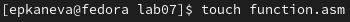{#fig:019 width=70%}

Введём текст программы (рис. [-@fig:020]):

```
%include 'in_out.asm'

SECTION .data
stm: DB 'y = (9x - 8) / 8', 0
msg: DB 'Введите значение x: ', 0
res: DB 'Результат вычислений: ', 0

SECTION .bss
x: RESB 80

SECTION .text
GLOBAL _start
_start:

mov eax, stm
call sprintLF
mov eax, msg
call sprintLF

mov ecx, x
mov edx, 80
call sread

mov eax, x
call atoi

mov ebx, 12
mul ebx
add eax, 3
xor edx, edx
mov ebx, 5
idiv ebx
mov edi, eax

mov eax, res
call sprint
mov eax, edi
call iprintLF

call quit
```

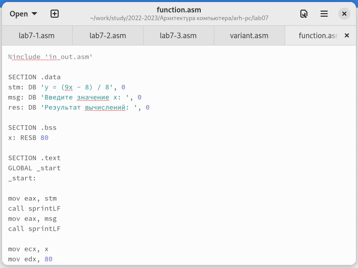{#fig:020 width=70%}

Создадим исполняемый файл и запустим его (рис. [-@fig:021] и [-@fig:022]):

```
nasm -f elf function.asm
ld -m elf_i386 -o function function.o
./function
```

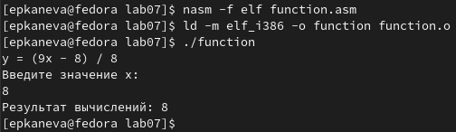{#fig:021 width=70%}

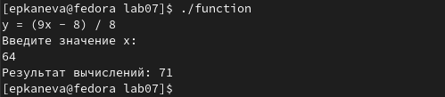{#fig:022 width=70%}

Проверим вычисления, выполненные программой:

(9 * 8 - 8) / 8 = 8
(9 * 64 - 8) / 8 = 71

Программа работает корректно.

# Выводы

Освоили арифметические инструкции языка ассемблера NASM.
